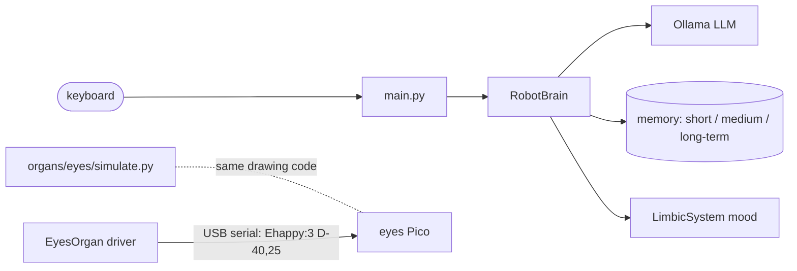
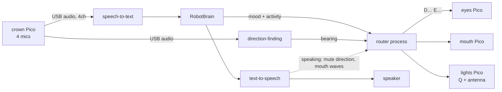

# Architecture

How Qbot fits together, now and where it's heading. Each code area's own
README has the details; this is the map.

## The biology layout

The code is organised like a body:

- **`brain/`** — cognition (the LLM conversation), memory, and mood (`limbic/`).
- **`nervous_system/`** — carries messages between the brain and organs.
- **`organs/`** — one folder per physical subsystem that has code (eyes now;
  mouth, lights, ears, voice later). Firmware for an organ's microcontroller
  lives inside it (e.g. `organs/eyes/firmware/`).
- **`anatomy/`** — the physical robot itself: build notes, wiring, photos,
  CAD, and explanations for Henry. No code.

The brain never talks to hardware. It sends abstract intentions ("feeling
scared, 2") through the nervous system, which routes them to whichever
driver is registered — real hardware or a mock. So the brain and its tests
never depend on anything being plugged in.

## Today



The eyes driver and firmware work, but nothing connects the brain to them
yet (R-207, R-208).

## Where it's heading



Key choices (see `docs/decisions/`):

- **The brain computer is the hub.** Every Pico plugs into it by USB, and
  the **router** runs as its own process, separate from `chat()` (D-003).
  Direction is a reflex and must never wait for the LLM.
- **The brain sends a mood; the router decides what each face part shows**
  (D-008).
- **One Pico per organ** (D-009). **The crown is one USB device with audio +
  serial** (D-005). **Direction maths runs in Python first** (D-006).
- **Indicator LEDs are driven by the hardware they report on** (D-007).
  **Asleep means mics and cameras off** (D-010).

## A conversation turn

1. `RobotBrain.chat()` starts a session if needed (logging, a random wake mood).
2. It builds the system prompt: personality, current mood, response format,
   relevant long-term memories, the medium-term summary.
3. The LLM answers as JSON — `{"reply", "mood"}`, constrained by
   `response_schema.py`.
4. The mood signal nudges `LimbicSystem` (see `brain/limbic/README.md`).
5. The exchange is logged and added to short-term memory, and evicted
   exchanges are compressed into medium-term.
6. Activity resets the session's inactivity timer.

## Memory

**Short term** — the current conversation, kept word for word. After 10
exchanges the oldest are compressed into medium-term.

**Medium term** — a rolling summary of older exchanges in this session.
Keeps a long conversation's context without overwhelming the model. Wiped
at session end.

**Long term** — built during *rest* after a session ends. Memorable facts
and moments are pulled from the raw log and stored in ChromaDB (a vector
database), then retrieved by meaning when relevant later. The rest process
only builds memories from conversations with 4+ logged lines.

**Key facts** — a structured fact store, currently switched off (R-103).

**Session reset** — after 5 minutes of inactivity the conversation is
over: short and medium-term memory are cleared, and the session is
processed into long-term memory.

## Project structure

```
Robot4Henry/
├── CLAUDE.md                  # guide for agents: where things live, rules for keeping docs current
├── main.py                    # entry point (terminal chat)
├── run_scenario.py            # run a scenario conversation interactively
├── wipe_memory.py             # memory reset utility
├── config/settings.py         # all configuration
├── brain/
│   ├── cognition/             # robot_brain.py (wires it together), llm_client.py, response_schema.py
│   ├── memory/                # short_term, medium_term, long_term (ChromaDB), key_facts
│   ├── limbic/                # mood + LimbicSystem — see its README
│   ├── session_manager.py     # inactivity detection, session lifecycle
│   ├── raw_logger.py          # every exchange to SQLite
│   └── rest_process.py        # builds long-term memory after sessions
├── nervous_system/            # bus, serial transport, JSON protocol — see its README
├── organs/
│   ├── base.py                # Organ interface + MockOrgan
│   └── eyes/                  # host driver, simulator, Pico firmware — see its README
├── anatomy/                   # the physical robot, per part — see its README
├── docs/
│   ├── architecture.md        # this file
│   ├── roadmap/               # phases.md, items/, generated README.md
│   ├── decisions/             # one record per non-obvious choice
│   ├── journal/               # one entry per week
│   └── build_index.py         # regenerates the roadmap/decisions/journal indexes
├── storage/                   # robot.db + chroma_db (gitignored)
└── tests/                     # brain/, nervous_system/, organs/, docs/, scenarios/
```
